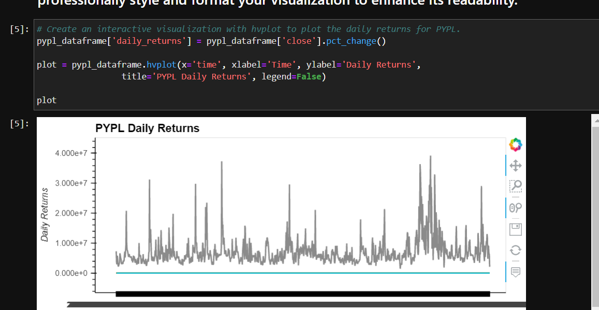

# Module_7_Challenge
ETF Analyzer

Hello, this project an ETF (Exchange-Traded Fund) analyzer is a tool or framework used to evaluate and analyze various aspects of an ETF. It typically involves examining different metrics, performance measures, holdings, expenses, and other factors to assess the characteristics and suitability of an ETF for investment purposes.

---

## Technologies

pandas is a software library written for the Python programming language for data manipulation and analysis. In particular, SQL (Structured Query Language) is a programming language used for managing and manipulating relational databases.

---

## Installation Guide

The installation process is: 

---

## Usage

---

## Contributors

-Name: John Nguyen
-Email: nguyenjohn1337@gmail.com

---

## License

When you share a project on a repository, especially a public one, it's important to choose the right license to specify what others can and can't with your source code and files. Use this section to include the license you want to use.

Specify the details of your project’s license - that is, how others can or cannot use your code and files.
